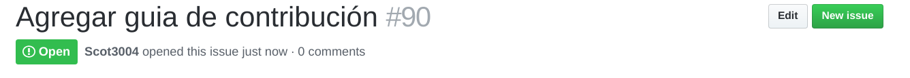

# ¿Cómo Contribuir?

Existen muchas formas en las que puedes contribuir al *workshop de protractor de la comunidad Agile Testing Colombia*.

Contribuyendo con código, escribiendo documentación, reportando errores, así como leyendo y proporcionando tus comentarios a issues y pull-requests (PR), todas son maneras necesarias y validas de ayudar.

Si deseas colaborar con código fuente, es importante tener en cuenta las siguientes recomendaciones, que permitirán tener un control de los cambios que se implementen y nos permita trabajar bajo los mismos lineamientos.

## Haciendo cambios en el código

Al ser *el código fuente del workshop de protactor* un proyecto abierto, todos pueden contribuir con sus cambios e integrarlos al repositorio principal de una forma fácil.

Para esto recomendamos que todo el trabajo que hagas, lo realices en una rama (branch) aparte. Cuando estés listo para trabajar en un error o en una nueva característica, crea una rama (branch). La razón por la que esto es importante es que puedes hacer tantos commits como consideres necesario. Cuando estés listo puedes mezclarlos. Miremos como es el flujo básico:

```bash
    git checkout –b task-556
    … fix and git commit often …
    git push origin task-556
```

La razón por la que hemos creado dos ramas, es con el fin de mantenernos alejados de la principal (master). Mantener la rama master limpia para los cambios provenientes del repositorio principal (upstream) hace tu vida y la nuestra más sencilla. Puedes enviarnos un pull request de tus cambios. Nosotros lo revisaremos e integraremos al repositorio base.

Ten muy en cuenta los [Estilos de codificación](#Estilo-de-codificación), debido a que pueden ser la causa de un rechazo a un pull-requests.

## Estilo de codificación

Cuando vayas a escribir código que quieras que sea incluido en *la página web comunidad Agile Testing Colombia*, ten en cuenta el estilo de codificación que utilizas.

Estaremos validando que el código propuesto, cumpla con la mayoría de las reglas definidas a continuación y en determinado momento, el no cumplir con estos estilos puede generar un rechazo de tu PR.

> - Sigue los lineamientos de [AirBnb para TypeScript][1]

## Pull Requests

Por favor mantén tus pull requests enfocados en un solo tema en específico.
Si tienes un número de solicitudes por enviar, entonces envía solicitudes separadas. Es mucho más fácil recibir solicitudes pequeñas y bien definidas, que tener que revisar y gestionar solicitudes grandes que apuntan a diferentes temas.

## Cierre automático de issues

Por favor asocia los pull request que hagas a los issues que estas resolviendo, preferiblemente usando la palabra 'fix' por ejemplo:

```bash
Fix #145
```

El cual cierra el issue #90 'Agregar guiá de contribución'

Para ver cual es el numero de issue asociado al caso que quieres resolver, lo encuentras al lado o debajo del titulo del ticket:



Si quieres ver que otras palabras pueden cerrar automaticamente un issue (en ingles) ingresa al siguiente enlace: https://help.github.com/articles/closing-issues-using-keywords/ 

[1]: https://github.com/airbnb/javascript
